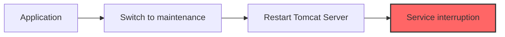
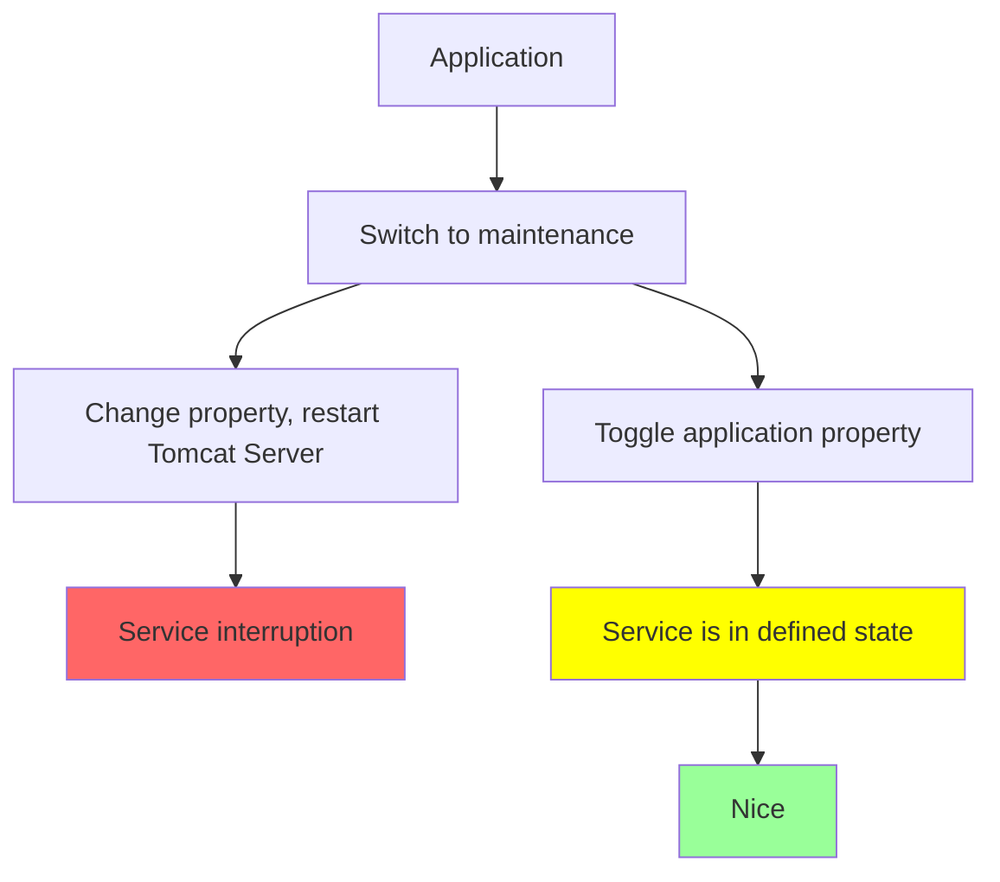

# Allianz test. Web appication: troubleshooting and improvements

## Setup
* Ubuntu 22.04 LTS (or similar) running on AWS/EC2
* Apache HTTP Server installed and configured to act as a reverse proxy
* Apache Tomcat 9 installed, with a simple “ROOT” webapp deployed
* The web application currently returns an HTTP 503 error
* Apache listens only on port 80

## 1. Task Findings & Fixes
*Question:*
* What you discovered, how you analysed the issue, and how you
approached fixing it.
* Explain any improvements or adjustments you made.

*Answer:*

**Discovery result:**

a) The Application (a servlet) is deployed at the Apache Tomcat application server. In its lifecycle can be switched to `maintenance mode` through toggling a "Java System Property" to 1 or 0.

b) It is implemented globally as the argument at the server startup script.

с) This solution leads to the issue where changing the parameter needs the application server restart.




**Finding the issue:**

1 Make sure what services are listening
```sh
sudo ss -tunlp

# we get 80 and 8080:
# 80    - is for Apache web-server which implements reverse-proxy
# 8080  - is for Tomcat
```

2 Check the url

2.1 Check the url through the reverse proxy first
```sh
curl -L http://localhost

# The answer is HTTP 503
```

2.2 Check the url directly through Tomcat
```sh
curl -L http://localhost:8080

# The same answer is HTTP 503
# 
# That means, that Apache works and we need to focus on the application server or deployed application.
```

## Some important info

https://developer.mozilla.org/en-US/docs/Web/HTTP/Reference/Status/503
> Common causes are that a server is down for maintenance or overloaded

As the nor server neither application server are overloaded (check the processes with `top`) that means it is most probably in maintenance mode.


3 Check Tomcat logs

3.1 Find where the applicatin server is
```sh
ps aux | grep tomcat

# here we get the whole path to the tomcat binary file
```

3.2 What applications are deployed on this server
```sh
cd /var/lib/tomcat9/webapps

# the result is: `ROOT` (which stated in the task description)
```

3.3 Check the content
```java
cat ROOT/index.jsp


Context env = (Context) new InitialContext().lookup("java:comp/env");
Boolean maintenance = (Boolean) env.lookup("maintenance");

if (Boolean.TRUE.equals(maintenance)) {
    response.setStatus(503);
    response.setHeader("X-Maintenance","on");
```
---
# Aha! This is a property. So, this is not a backend or middleware problem

3.4 However, check Tomcat logs just in case
```sh
tail -n 100 /var/lib/tomcat9/logs/catalina.log


catalina.2025-11-02.log:02-Nov-2025 21:44:00.884 INFO [main] org.apache.catalina.startup.VersionLoggerListener.log Command line argument: -DMAINTENANCE=1
catalina.2025-11-02.log:02-Nov-2025 21:44:08.038 INFO [main] org.apache.catalina.startup.VersionLoggerListener.log Command line argument: -DMAINTENANCE=1
catalina.2025-11-03.log:03-Nov-2025 16:57:52.489 INFO [main] org.apache.catalina.startup.VersionLoggerListener.log Command line argument: -DMAINTENANCE=1
catalina.out:[2025-11-02 21:44:00] [info] Command line argument: -DMAINTENANCE=1
catalina.out:[2025-11-02 21:44:08] [info] Command line argument: -DMAINTENANCE=1
catalina.out:[2025-11-03 16:57:52] [info] Command line argument: -DMAINTENANCE=1
```
# And this is correct: the message is INFO (neither CRITICAL nor ERROR). And this is the command line argument.


3.5 Just check this hypothesis with bing.com/copilot
```sh
#Query:
#java system property tomcat


#Answer:

To set and use Java system properties in Apache Tomcat, you can follow these steps:

1. Setting System Properties in Tomcat
Option 1: Using setenv.sh or setenv.bat

Locate the bin directory in your Tomcat installation.
Create or edit the setenv.sh (Linux/macOS) or setenv.bat (Windows) file.
Add the following line to define your system property:Bashexport JAVA_OPTS="$JAVA_OPTS -DpropertyName=propertyValue"

Example:Bashexport JAVA_OPTS="$JAVA_OPTS -Dapp.env=production"


Option 2: Editing catalina.sh or catalina.bat

Open the catalina.sh (Linux/macOS) or catalina.bat (Windows) file in the bin directory.
Add the system property to the JAVA_OPTS variable:BashJAVA_OPTS="$JAVA_OPTS -DpropertyName=propertyValue"

Example:BashJAVA_OPTS="$JAVA_OPTS -Dapp.env=production"


Option 3: Using catalina.properties

Open the conf/catalina.properties file in your Tomcat installation.
Add your property in the format:PropertiespropertyName=propertyValue


2. Accessing System Properties in Java Code
Once the property is set, you can access it in your Java application using:
JavaString value = System.getProperty("propertyName");
System.out.println("Property Value: " + value);


3. Example Use Case
If you set a property like:
Bash-Dapp.env=production

You can retrieve it in your Java code:
JavaString environment = System.getProperty("app.env");
System.out.println("Running in environment: " + environment);


4. Notes

Precedence: Properties set in setenv.sh/setenv.bat or catalina.sh/catalina.bat take precedence over those in catalina.properties.
Restart Required: After setting the properties, restart Tomcat for the changes to take effect.

This approach is commonly used for configuring environment-specific settings, such as database URLs, API keys, or application modes.
```


**Aproach to fixing***

3.5 Is the Tomcat started by SystemD?
```sh
systemctl \
  list-units \
  --no-pager \
  --type=service 
  --state=running \
  | grep tomcat

# we have here the info that the Tomcat is started by the SystemD and the service name is "tomcat9".
```

3.6 Get more info about the service
```sh
sudo systemctl status tomcat9

● tomcat9.service - Apache Tomcat 9 Web Application Server
    Loaded: loaded (/lib/systemd/system/tomcat9.service; enabled; vendor preset: enabled)
    Drop-In: /etc/systemd/system/tomcat9.service.d
             └─env.conf
```

3.7 Check `env.conf` file first:

3.7.1 Read the content
```sh
cat /etc/systemd/system/tomcat9.service.d/env.conf
[Service]
Environment="JAVA_OPTS=-Djava.awt.headless=true -DMAINTENANCE=1"
```
3.7.2 Make changes and test
```sh
1 -> 0

sudo systemctl daemon-reload
sudo systemctl tomcat9 restart
curl http://localhost:8080

# Same answer HTTP 503. So, revert changes
```

3.8 Check the context of the service file
```sh
cat /lib/systemd/system/tomcat9.service

# ...
# Lifecycle
# ...
ExecStart=/bin/sh /usr/libexec/tomcat9/tomcat-start.sh			#### <<--- Here! this is the start-up script for the server. Means all JAVA_OPTS can be set there.
```

3.9 Check the start-up file
```sh
cat /usr/libexec/tomcat9/tomcat-start.sh
#!/bin/sh
#
# Startup script for Apache Tomcat with systemd
#
# ...
. /etc/default/tomcat9 ####  <<---- Service settings. Go here
```


3.11 Check tomcat9 service parameters file
```sh
cat  /etc/default/tomcat9
# Set MAINTENANCE=1 so app returns 503 (intentional for exercise). Change to 0 to return 200.
# Changed by Andriy Kravchuk 03.10.2025, 18:39          # <-- Added info for change tracking
# MAINTENANCE=1 -> MAINTENANCE=0                        # <-- Make sure the team knows what's done
# JAVA_OPTS="-Djava.awt.headless=true -DMAINTENANCE=1"  # <-- Keep the original param just in case

#
#
# And this is here!
#
#


# CHANGE IT
JAVA_OPTS="-Djava.awt.headless=true -DMAINTENANCE=0"
```

4. Restart and check
```sh
sudo systemct restart tomcat9
journalctl -f -u tomcat9
curl -L http://localhost:8080

## HTTP 200 and the page content
```

**Explain any improvements or adjustments you made.**

1 Change to application or microservice maintenance status toggle by narrowing approach from server-wide to microservice-wide.

1.1 Add context file: ./META-INF/context.xml
```xml
<Context>
    <Environment name="maintenance" type="java.lang.Boolean" value="false" override="false"/>
</Context>
```

1.2 Application code stays the same (no changes necessary - only at the infrastucture level):
```java
Context env = (Context) new InitialContext().lookup("java:comp/env");
Boolean maintenance = (Boolean) env.lookup("maintenance");
```


1.3 How to toggle the status: `false` or `true`.
## It's possible because of XPATH!

```sh
# Use standard soft from linux distro (`xmlstarlet`)
xmlstarlet \
    ed \
    --inplace \
    -u '//Environment[@name="maintenance"]/@value' \
    -v 'false' \
    ./context.xml
```
1.4 Simple diagram



2 Change the deployment approach

2.1 Install Jenkins and compatible JRE encapsulated to one folder:
```sh
/opt/deploy
```

2.1.1 Let Jenkins run under a separate system user
```sh
sudo useradd -r -s /sbin/nologin deploy
```

2.1.2 Any new folders/files will inherit rights from `webapps` folder.
```sh
sudo chmod 2750 /var/lib/tomcat9/webapps
```

2.1.3 Jenkins which is in `deploy` group whill have the access to this folder
```sh
sudo setfacl -R -d -m u:deploy:rwx,g:tomcat:rwx /var/lib/tomcat9/webapps
```

2.1.4 Start Jenkins with a script. In Prod add to SystemD service of course
```sh
cat ./start-jenkins.sh
#!/bin/bash

export JENKINS_HOME=/opt/deploy

/opt/deploy/jdk-21.0.9/bin/java \
        -jar ./jenkins.war \
        --httpPort=8888 \
        --httpListenAddress=localhost \
        --prefix=/jenkins
```

2.1.6 Make it available from outside without SSH. This is LAB, so in prod it's HTTPS of course.
```sh
vi /etc/apache2/sites-enabled/010-proxy-tomcat.conf
<VirtualHost *:80>
  ServerName _
  ProxyPreserveHost On
  RequestHeader set X-Forwarded-Proto "http"
  RequestHeader set X-Maintenance "on"

  # Jenkins
  ProxyPass         /jenkins http://127.0.0.1:8888/jenkins
  ProxyPassReverse  /jenkins http://127.0.0.1:8888/jenkins

  # Tomcat
  ProxyPass        /  http://127.0.0.1:8080/
  ProxyPassReverse /  http://127.0.0.1:8080/

  ErrorLog  ${APACHE_LOG_DIR}/tomcat-proxy-error.log
  CustomLog ${APACHE_LOG_DIR}/tomcat-proxy-access.log combined
</VirtualHost>
```

2.2  Setup pipelines: one for the applications another one for maintenance. 

2.2.1 This pipeline if for `product lifecycle`
```yaml
# Let's use some repository with `main` branch
#
Path:             New item \ Pipeline
Pipeline type:    Pipeline from the SCM
Repository URL:   https://github.com/akravcuk/test
Branch Specifier: */main
```
2.2.2 This pipeline is for `maintenance`
```yaml
Path:             New item \ Pipeline
Pipeline type:    Pipeline from the pipeline script
```

## Summary
### Once we need to deploy the application we change the maintenance mode with Jenkins script

### Pipelines

### App lifecycle
```groovy
pipeline{
  agent any

  environment {
    JAVA_VERSION_REQUIRED = "11"
    TOMCAT_WEBAPPS_PATH="/var/lib/tomcat9/webapps"
    SERVLET_FOLDER_NAME="hello"
  }

  stages {

    stage('Prepare'){
      steps{
        sh'''
          JAVA_VERSION=$(java -version 2>&1 | perl -ne 'print $1 if /version.*?(11)/')

          if [ "$JAVA_VERSION" != "$JAVA_VERSION_REQUIRED" ]; then
            echo "Installed Java vesion is: $JAVA_VERSION. Required: JAVA_VERSION_REQUIRED"
            exit 1
          else
            echo "Installed Java vesion is: $JAVA_VERSION and this is compliant. Continue"
          fi
        '''
      }
    }


    stage('Deploy'){
      steps{
        sh'''
          SERVLET_FULL_NAME="$TOMCAT_WEBAPPS_PATH/$SERVLET_FOLDER_NAME"

          if [ -d "$SERVLET_FULL_NAME" ]; then
            rm -rf "$SERVLET_FULL_NAME"
          fi

          if [ ! -d "$SERVLET_FULL_NAME" ]; then
            mkdir $SERVLET_FULL_NAME
          else
            echo "Can't create servlet directory: $SERVLET_FULL_NAME"
            exit 1
          fi

          cp -r ./app/hello-tomcat/* $SERVLET_FULL_NAME/
          
        '''
      }
    }

    stage('Test application endpoint'){
      steps{
        // Check service availability. Implement retry-pattern
        sh'''
          URL="http://localhost:8080/hello"
          MAX_RETRY_TIMES=5
          DELAY_SECONDS=10


          for i in $(seq 1 $MAX_RETRY_TIMES); do
            HTTP_CODE=$(/usr/bin/curl -Lso /dev/null -w "%{http_code}" http://localhost:8080/hello)

            if [ $HTTP_CODE -eq 200 ]; then
              echo "Service is UP"
              exit 0
            fi
            echo "Retrying in ${DELAY_SECONDS} seconds..."
            sleep $DELAY_SECONDS
          done

          echo "Service is not available. Attempts: $MAX_RETRY_TIMES. HTTP CODE: $HTTP_CODE"
          exit 1
        '''
      }
    }
  }
}
```
## App maintenance
```groovy
environment{
    TOMCAT_WEBAPPS_PATH="/var/lib/tomcat9/webapps/META-INF/context.xml"
}
pipeline {
  agent any
  
  stages {
    stage('Maintenance toggling') {
      steps {
        sh '''
          MAINTENANCE_STATUS=$(/usr/bin/xmlstarlet select -t -v '//Environment[@name="maintenance"]/@value' "$TOMCAT_WEBAPPS_PATH")

          if [ "$MAINTENANCE_STATUS" == "true" ]; then
            /usr/bin/xmlstarlet ed --inplace \
                -u '//Environment[@name="maintenance" and @value="true"]/@value' -v 'false' \
                "$TOMCAT_WEBAPPS_PATH"
            echo "Maintenance mode disabled in settings"
          else
            /usr/bin/xmlstarlet ed --inplace \
                -u '//Environment[@name="maintenance" and @value="false"]/@value' -v 'true' \
                "$TOMCAT_WEBAPPS_PATH"
            echo "Maintenance mode enabled in settings"
          fi
        '''
      }
    }

    stage('Test application endpoint status'){
      steps{
        // Check service status: must be 200 or 503 response. Implement retry-pattern
        sh'''
          URL="http://localhost:8080/hello"
          MAX_RETRY_TIMES=5
          DELAY_SECONDS=10


          for i in $(seq 1 $MAX_RETRY_TIMES); do
            HTTP_CODE=$(/usr/bin/curl -Lso /dev/null -w "%{http_code}" http://localhost:8080/hello)

            if [ $HTTP_CODE -eq 200 ]; then
              echo "Service is UP"
              exit 0
            fi
            if [ $HTTP_CODE -eq 503 ]; then
              echo "Service is in MAINTENANCE MODE"
              exit 0
            fi

            echo "Retrying in ${DELAY_SECONDS} seconds..."
            sleep $DELAY_SECONDS
          done

          echo "Service is not available. Attempts: $MAX_RETRY_TIMES. HTTP CODE: $HTTP_CODE"
          exit 1
        '''
      }
    }
  }
}
```


